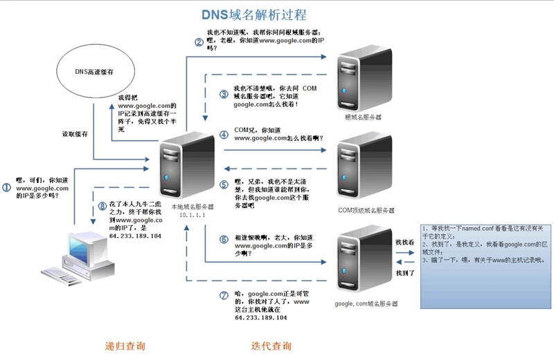

# 从输入URL到页面渲染经历了什么

从耗时过程来看，可以分为DNS解析、TCP连接、HTTP请求与响应、客户端浏览器解析渲染、连接结束。

其中浏览器解析渲染包含HTML词法、语法的解析、CSS解析、DOM树生成、渲染树建立、屏幕绘制。

#### DNS解析

DNS解析的过程就是域名到IP地址转换的过程。

域名解析成IP，服务由DNS服务器完成，把域名解析到一个IP地址，然后在此IP地址的主机上将一个子目录与域名绑定。

域名解析也叫域名指向、服务器设置、域名配置以及反向IP登记等。

#### TCP连接

TCP的连接目的是建立可靠的数据传输，保证消息的有序和不丢包。TCP通信双方互相告知初始化序列号，并确定对方已收到SN，这个连接过程成为TCP三次握手。

#### HTTP请求和响应

HTTP请求发生在客户端，客户端发起HTTP请求的过程就是构建HTTP请求报文并通过TCP协议发送到服务端指定端口的过程。

过程如下：

* 在地址栏输入URL，浏览器分析地址并设置请求报文发出
  * 请求报文：请求行（请求方法、路径和版本）+ 请求头（附加信息） + 空行 + 请求主体
* 服务端收到请求之后，会根据URL匹配到的路径进行相应处理，最后返回浏览器需要的页面数据
* 浏览器收到服务端的响应报文，所需的资源就在报文主体上
  * 响应报文：响应行（协议版本、状态码和状态码原因短语） + 响应头 + 空行 + 报文主体

#### HTML词法、语法解析

HTML本身是字符串，而我们需要的是字符流，所以为了把字符流解析成可被浏览器识别的结构，需要以下两步：

* 词法分析：把字符流初步解析成可理解的词，`token`
* 语法分析：配对标签、赋值属性、连接父子、构成DOM树

#### DOM树生成和渲染树建立

一般HTML解析完之后就会生成DOM树，当CSS解析完成后，配合DOM树就会完成渲染树的建立，也就是整个页面的框架基本构成。

#### 屏幕绘制

完成DOM树和渲染树的阶段后就进入屏幕绘制了，在绘制过程中，会遍历渲染树，调用由浏览器的UI组件的`paint()`方法在屏幕上显示对应内容，并根据渲染树布局计算CSS样式。

HTML默认是从上往下流式布局的，CSS和JS的加入会打破这个默认规则，改变DOM的样式、大小和位置，这就是`repaint`（重绘）和`reflow`（回流）。

* `repaint`：屏幕的一部分重新绘制，不影响整体布局
* `reflow`：重新计算渲染树，会改变布局

